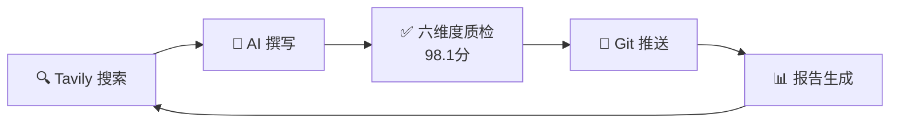

<div align="center">

# 🦞 OpenClaw 实战教程

**从零到精通的 OpenClaw Agent 自动化开发指南**

[](.) [](.) [](.) [](LICENSE) [](.)

*本教程由 AI Agent 自动生成、持续优化，覆盖 OpenClaw 安装部署、Skills 开发、自动化集成到企业级实战的完整知识体系。*

</div>

---

## 🎯 适合谁

| 读者类型 | 推荐路径 |
|----------|---------|
| **新手入门** | 从第 1 章开始，按顺序阅读 |
| **有基础** | 直接跳到第 6 章（自动化）或第 7 章（飞书集成） |
| **高级用户** | 第 8 章（多 Agent）、第 11 章（第三方集成）、第 12 章（实战案例） |

## 📚 章节目录

| # | 章节 | 难度 | 简介 |
|---|------|------|------|
| 01 | [基础介绍与安装](01-基础介绍与安装.md) | ⭐ | OpenClaw 是什么、架构概览、安装与验证 |
| 02 | [部署与环境初始化](02-部署与环境初始化.md) | ⭐ | 服务端部署、配置文件、网络安全 |
| 03 | [Skills 插件体系与批量开发](03-Skills%20插件体系与批量开发.md) | ⭐⭐ | Skill 结构、SKILL.md 规范、批量开发实践 |
| 04 | [Skills 安装与管理实践](04-Skills%20安装与管理实践.md) | ⭐⭐ | ClawdHub 安装、版本管理、依赖排查 |
| 05 | [ClawHub 平台与技能分发](05-ClawHub%20平台与技能分发.md) | ⭐⭐ | ClawHub 生态、发布与分发、社区协作 |
| 06 | [自动化命令与脚本集成](06-自动化命令与脚本集成.md) | ⭐⭐⭐ | CLI 工具、Hook 系统、Cron 调度 |
| 07 | [飞书集成与消息自动化](07-飞书集成与消息自动化.md) | ⭐⭐⭐ | 飞书 App 配置、消息收发、群聊自动化 |
| 08 | [单 Gateway 多 Agent 配置](08-单%20Gateway%20多%20Agent%20配置与管理.md) | ⭐⭐⭐ | 多 Agent 架构、会话路由、资源隔离 |
| 09 | [故障排查与日志分析](09-故障排查与日志分析.md) | ⭐⭐ | 日志体系、常见故障、诊断工具 |
| 10 | [持续集成与知识库同步](10-持续集成与知识库同步.md) | ⭐⭐⭐ | CI/CD 集成、知识库管理、自动同步 |
| 11 | [高级场景：第三方平台集成](11-高级场景-第三方平台集成.md) | ⭐⭐⭐⭐ | GitHub/Notion/Telegram/Discord 集成 |
| 12 | [实践案例与常见问题](12-实践案例与常见问题.md) | ⭐⭐⭐ | 知识助手、监控机器人、全链路自动化案例 |
| 13 | [教程自动更新与仓库维护](13-教程自动更新与仓库维护.md) | ⭐⭐ | 自动化维护、Cron 任务、持续优化 |

## 🚀 快速开始

```bash
# 克隆仓库
git clone https://github.com/zxk-git/openclaw-tutorial-auto.git
cd openclaw-tutorial-auto

# 从第一章开始阅读
# 或者在 GitHub 上直接点击上方章节链接
```

## 🏗️ 技术栈

本教程由 [complex-task-automator](https://github.com/zxk-git/complex-task-automator) Skill 自动生成，采用以下工具链：



| 组件 | 说明 |
|------|------|
| **信息搜集** | Tavily API 实时搜索最新资料 |
| **内容生成** | 知识库驱动的章节撰写 |
| **质量检测** | 六维度评估（内容/结构/代码/可读性/教学/时效） |
| **自动推送** | Git 安全提交 + 远程推送 |
| **持续优化** | 24/7 Cron 调度，自动搜索新内容并合并 |

## 📖 教程特色

- **实战导向** — 每章包含可运行的代码示例和预期输出
- **循序渐进** — 从基础概念到高级实战，难度标注清晰
- **持续更新** — AI 24/7 自动搜索最新信息并优化内容
- **高质量保证** — 六维度质量检测系统，平均评分 98.1/100 (A 级)

## 📄 License

MIT

---

<div align="center">
<sub>由 OpenClaw Agent 自动生成和维护 | 欢迎 Star ⭐ 和反馈</sub>
</div>
